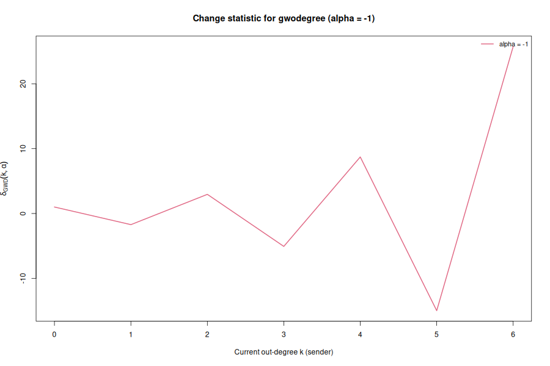
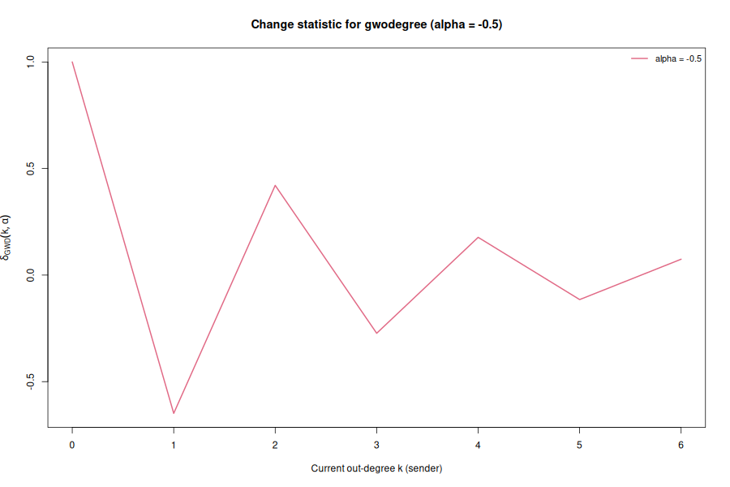
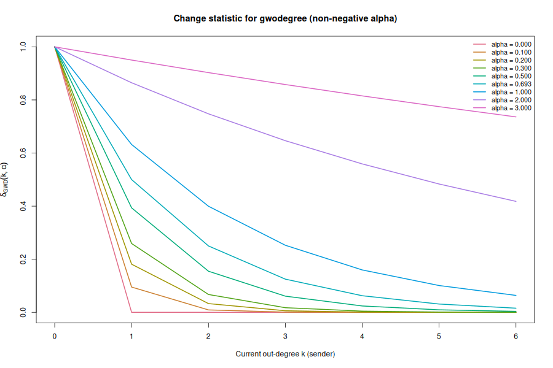
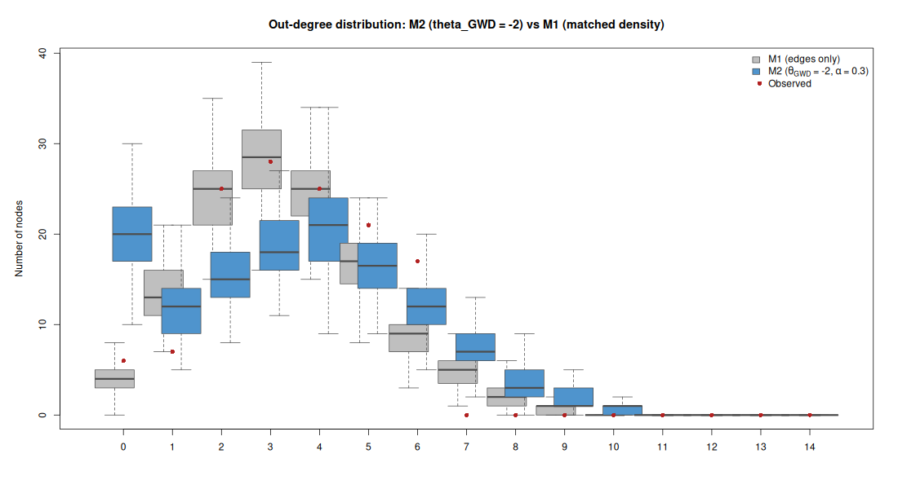
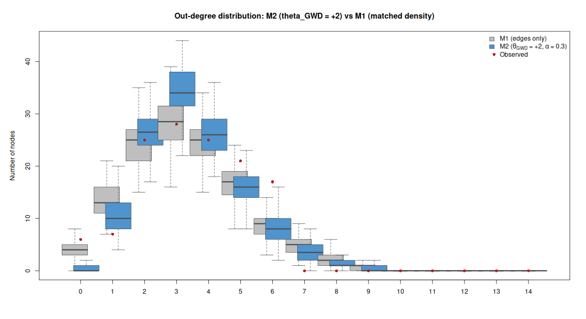

```{r setup, include=FALSE}
knitr::opts_chunk$set(
  echo = TRUE,
  error = TRUE,
  message = FALSE,
  warning = FALSE,
  fig.pos = "H",
  out.width = "40%"
)
```
All computations use the Wave 1 directed friendship network (`Glasgow/f1.csv`) with `n = 129` students (diagonal fixed to 0). The observed network has `m = 448` directed edges (density `m / (n(n-1)) = 0.02713`), and the maximum observed out-degree is `6`.

To reproduce plots/tables in this write-up, run:

```{bash}
Rscript Task1.R
```

This creates figures in `task1_figures/` and intermediate tables in `task1_results/`.

---

## (1) Change statistic of `gwodegree`

### (1.1) Derive the change statistic

The statistic is

\[
s_{\mathrm{GWD}}(x,\alpha) = e^{\alpha}\sum_{k=1}^{n}\left(1 - (1-e^{-\alpha})^{k}\right)D^{\mathrm{out}}_{k}(x).
\]

Consider toggling on one directed edge from a sender whose current out-degree is \(k\). Then exactly one node changes out-degree from \(k\) to \(k+1\), so:
- \(D^{\mathrm{out}}_k\) decreases by 1 and
- \(D^{\mathrm{out}}_{k+1}\) increases by 1.

Therefore the change statistic is

\[
\begin{aligned}
\delta_{\mathrm{GWD}}(k,\alpha)
&= e^{\alpha}\Big[\big(1-(1-e^{-\alpha})^{k+1}\big)-\big(1-(1-e^{-\alpha})^{k}\big)\Big] \\\\
&= e^{\alpha}\Big[(1-e^{-\alpha})^{k}-(1-e^{-\alpha})^{k+1}\Big] \\\\
&= e^{\alpha}(1-e^{-\alpha})^{k}\Big[1-(1-e^{-\alpha})\Big] \\\\
&= e^{\alpha}(1-e^{-\alpha})^{k} e^{-\alpha} \\\\
&= (1-e^{-\alpha})^{k}.
\end{aligned}
\]

So,

\[
\boxed{\delta_{\mathrm{GWD}}(k,\alpha) = (1-e^{-\alpha})^{k}\quad \text{for }k\ge 0.}
\]

---

### (1.2) Plots of \(\delta_{\mathrm{GWD}}(k,\alpha)\) vs. \(k\)

Plots were produced for \(k = 0,\dots,6\) (the maximum observed out-degree in Glasgow Wave 1).

- Negative decay values:
  - `task1_figures/gwodegree_change_alpha_-1.png`
  - `task1_figures/gwodegree_change_alpha_-0.5.png`
- Non-negative decay values:
  - `task1_figures/gwodegree_change_alpha_nonneg.png`





---

### (1.3) Main takeaways

From the analytic expression \(\delta_{\mathrm{GWD}}(k,\alpha)=(1-e^{-\alpha})^{k}\), the decay parameter \(\alpha\) directly controls how the marginal contribution of an additional out-tie changes with the sender’s current out-degree.

For non-negative \(\alpha\) we have \(0 \le 1-e^{-\alpha} < 1\), so \(\delta_{\mathrm{GWD}}(k,\alpha)\) is non-negative and decreases exponentially in \(k\). This means additional outgoing ties have the largest marginal contribution when the sender currently has low out-degree, and the marginal contribution becomes small for already-active senders. The strength of this “diminishing returns” behaviour is governed by \(\alpha\): when \(\alpha\) is small and positive, \(1-e^{-\alpha}\) is close to 0, so the marginal contribution drops to near-zero after only a few outgoing ties. In the limiting case \(\alpha=0\), the first outgoing tie contributes 1 (at \(k=0\)) and further outgoing ties contribute 0, so the statistic essentially counts how many actors have at least one outgoing tie. When \(\alpha\) is large, \(1-e^{-\alpha}\) approaches 1 and \(\delta_{\mathrm{GWD}}(k,\alpha)\) stays close to 1 even for larger \(k\). In that regime `gwodegree` becomes increasingly similar to an edges-like term (each additional edge changes the statistic by almost the same amount), so the term loses its ability to meaningfully distinguish between moderate and high out-degrees.

For negative \(\alpha\), \(1-e^{-\alpha}<0\) and the change statistic alternates sign with \(k\). For \(\alpha=-0.5\), \(|1-e^{-\alpha}|<1\) so the magnitude still decays with \(k\) (but oscillates in sign). For \(\alpha=-1\), \(|1-e^{-\alpha}|>1\) so the magnitude grows rapidly with \(k\), making the marginal effect extremely sensitive to already-high out-degree. This behaviour is typically undesirable in ERGMs because it can lead to unstable contributions and counter-intuitive incentives for adding/removing ties depending on the parity of \(k\).

---

### (1.4) Choosing \(\alpha\) for an “activity-among-the-active” effect

An “activity-among-the-active” effect can be understood in two ways. If we mean that an additional outgoing tie should have a larger marginal contribution when the sender is already active, then the usual non-negative `gwodegree` term cannot really do this. The change statistic is

\[
\delta_{\mathrm{GWD}}(k,\alpha) = (1-e^{-\alpha})^{k}.
\]

For \(\alpha \ge 0\), this is non-increasing in \(k\). Thus the marginal contribution of an additional outgoing tie is largest for low out-degree senders and becomes smaller as the sender’s current out-degree grows.

However, if the goal is that the statistic remains sensitive to differences among already-active senders, then \(\alpha\) should be chosen relatively large and positive. A larger \(\alpha\) makes \(1-e^{-\alpha}\) closer to 1, so \(\delta_{\mathrm{GWD}}(k,\alpha)\) decays more slowly with \(k\). This means that adding a 4th, 5th, or 6th outgoing tie can still make a meaningful contribution to the statistic. In contrast, with small positive decay, the change statistic drops close to zero after only a few outgoing ties, so the term mostly distinguishes inactive or weakly active actors from others.

There is a trade-off. If \(\alpha\) is too large, \(\delta_{\mathrm{GWD}}(k,\alpha)\approx 1\) for all relevant \(k\), and `gwodegree` becomes close to an edges-like or linear out-degree term. If \(\alpha\) is too small, the term ignores variation among high-out-degree actors. Negative \(\alpha\) can make the absolute change grow with \(k\), but the alternating sign makes it hard to interpret and potentially unstable. Therefore, a moderate-to-large positive decay is the most appropriate choice.

---

## (2) Effect of the `gwodegree` coefficient on the out-degree distribution

### (2.1) Models

- M1 (reference): edges-only ERGM. This is equivalent to an i.i.d. Bernoulli model for directed edges with \(p=\) observed density, and \(\hat\theta_{\text{edges}}=\mathrm{logit}(p)\).
- M2: edges + `gwodegree` with fixed \(\alpha=0.3\) and fixed \(\theta_{\mathrm{GWD}}\in\{-2,+2\}\). For each fixed \(\theta_{\mathrm{GWD}}\), \(\theta_{\text{edges}}\) is chosen so that the expected density matches the observed density (simulation-based matching).

The fitted parameters (reproducible with the provided script) are:

| Model | \(\theta_{\text{edges}}\) | \(\theta_{\mathrm{GWD}}\) | \(\alpha\) |
|---|---:|---:|---:|
| M1 | -3.580 | 0 | – |
| M2 | -3.368 | -2 | 0.3 |
| M2 | -3.702 | +2 | 0.3 |

The same values are written to `task1_results/model_parameters.csv`.

---

### (2.2) Simulation and box plots

For each of the three models, 100 networks were simulated and the node count at each out-degree was computed. For M2, results are plotted against M1 (reference), and the observed Wave 1 counts are shown as red points.

- `task1_figures/outdegree_box_M2_gwd_-2.png`
- `task1_figures/outdegree_box_M2_gwd_+2.png`




---

### (2.3) Effects of \(\theta_{\mathrm{GWD}}\) on the out-degree distribution

Holding density fixed isolates how \(\theta_{\mathrm{GWD}}\) reshapes who sends ties, rather than how many ties exist overall. Relative to M1 (a random graph with the same density), changing \(\theta_{\mathrm{GWD}}\) primarily changes the heterogeneity of the out-degree distribution.

With \(\theta_{\mathrm{GWD}}=+2\) (and \(\alpha=0.3\)), adding an outgoing tie yields a larger positive contribution when the sender has low out-degree (because \(\delta_{\mathrm{GWD}}(k,\alpha)\) is largest at small \(k\)). This tends to distribute outgoing nominations more evenly across students: compared to M1, simulations show fewer extreme out-degree values and more mass around moderate degrees. In other words, positive \(\theta_{\mathrm{GWD}}\) with a fixed positive decay acts like a “regularizer” on activity, discouraging highly active senders because the marginal gain from additional outgoing ties quickly becomes small once \(k\) is already moderate.

With \(\theta_{\mathrm{GWD}}=-2\), the same diminishing change statistic implies that adding early outgoing ties is penalized strongly (large negative change in log-odds at low \(k\)), while adding ties for already-active senders is penalized relatively little (small magnitude at high \(k\)). This creates a cumulative advantage process: once a sender has accumulated some outgoing ties, additional ties become comparatively easier to add. As a result, the out-degree distribution becomes more skewed than under M1: more students have very low out-degree, while a smaller set of students becomes highly active and concentrates outgoing nominations.

Overall, \(\theta_{\mathrm{GWD}}\) tunes the degree heterogeneity around the same mean density: positive values push toward more homogeneous activity and negative values push toward more heterogeneous activity, relative to the edges-only random graph baseline.
